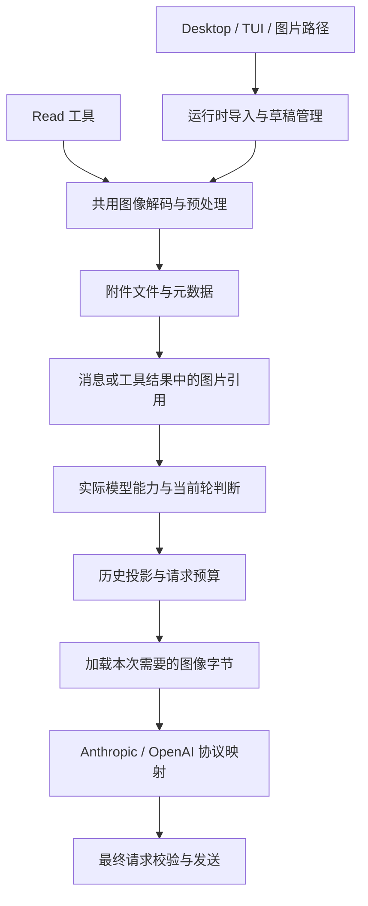

# Hanekawa 图像输入设计

日期：2026-09-08  
状态：讨论后的设计稿；本文件定义首版范围和实施方案，不代表功能已经实现。

Hanekawa 首版多模态输入以图像为中心，覆盖 Desktop、TUI、`@` 图片引用和 `Read` 工具。模型是否能够接收图片由用户显式配置。图片以独立文件持久化，消息保存引用；每次请求根据实际使用的模型，决定发送图像还是发送历史图像的文字占位符。

## 1. 已确认的产品决定

| 议题 | 讨论结论 |
| --- | --- |
| 首版范围 | 先完整支持图像，PDF 后续处理。 |
| 界面 | Desktop 和 TUI 同步支持，共用附件处理与请求逻辑。 |
| 模型能力 | 在模型设置中提供“支持图像输入”开关。 |
| 默认值 | 新模型和没有该字段的旧配置都默认关闭，用户手动开启；不根据模型名称猜测。 |
| 当前输入不兼容 | 当前模型不支持图像时，保留文字与新附件，阻止发送，提示切换模型。 |
| 历史图片不兼容 | 明确提示后，将历史图片转换为带路径的文字占位符继续请求；保留会话中的原图。 |
| 文件与工具入口 | 首版支持 `@图片路径` 和模型通过 `Read` 主动查看图片，复用处理管线。 |
| 大图策略 | 自动缩放和压缩，同时保留原图，供后续裁剪或重新读取。 |
| TUI 平台 | Windows、macOS、Linux 都支持图片剪贴板；环境依赖缺失时提示改用图片路径。 |

后文的类型命名、存储布局、格式范围、处理阈值和实施顺序是基于这些决定提出的工程方案，不是额外向用户确认过的配置项。

## 2. 首版交付范围

### 2.1 输入与显示

- Desktop：粘贴图片、拖入本地图片、文件选择器、多图附件列表、删除附件、缩略图与点击查看原图。
- TUI：显式读取图片剪贴板、识别粘贴或拖入的独立文件路径、附件编号列表、删除附件、可用时提供终端文件链接。
- 两端：纯图片消息、文字加多图、运行中排队、会话恢复、`@` 项目图片引用。
- 工具：`Read` 读取项目内图片，并允许重新读取本会话已保存的图片。
- Provider：现有 Anthropic Messages 和 OpenAI Chat Completions 两条请求路径。

### 2.2 格式与边界

| 来源格式 | 首版行为 |
| --- | --- |
| PNG、JPEG、静态 WebP | 解码校验后进入统一处理管线。 |
| GIF、动态 WebP | 使用第一帧，附件上明确标注；首版不理解动画时间序列。 |
| 系统剪贴板中的 BMP 等位图 | 由采集端输出 PNG，再进入统一处理管线。 |
| 直接导入 BMP、HEIC、TIFF、AVIF 文件 | 首版不承诺支持，提示先转换为 PNG/JPEG；不假设 `sharp` 能解码所有格式。 |
| SVG | 保留现有文本读取语义；首版不作为视觉附件渲染上传。 |
| PDF、音频、视频 | 后续设计，不混用“支持图像输入”开关。 |

首版不增加远程 URL 图片下载、PDF 转页、OCR 服务、图片生成工具，也不扩展权限弹窗和 `AskUserQuestion` 的图片回答能力。MCP 返回的标准 image 块后续可接入同一工具结果结构，但不作为本次入口交付范围；当前 MCP 包装器会把非文本内容 JSON 字符串化，不能据此宣称已经支持 MCP 图片。

## 3. 当前代码与接入位置

以下以本次阅读的工作区代码为准。

| 现状 | 设计影响 |
| --- | --- |
| `src/config/service.ts` 的 `ModelConfig` 没有图像能力字段 | 增加显式布尔配置，经过现有全局配置与 reload 流程传播。 |
| `src/harness/types.ts` 的 `ChatMessage.content`、`ToolResult.content` 都是字符串 | 保留文本字段，增加独立图像引用，避免改成到处需要分支处理的字符串/数组联合类型。 |
| `src/runtime/sessionController.ts`、协议 `submit`、`MessageQueue` 只传文本 | 提交、排队、撤回和恢复都要传递完整输入。 |
| `src/harness/atMentions.ts` 只展开代码文本，当前上限为 5 个引用 | 新增图片分支；图片不占用代码文本展开额度，也不能在现有截断处被静默丢弃。 |
| `src/tools/FileReadTool/` 只有文本读取，且保存供 `Edit` 使用的全文件状态 | 在文本读取前识别图片；图片不能进入文本编辑缓存。 |
| `src/config/providers/*Payload.ts` 以文本构建用户消息与工具结果 | 分别增加协议映射，保持工具调用配对和缓存控制规则。 |
| `src/harness/mediaStrip.ts` 已有入口，但当前是 no-op | 将其落实为有返回诊断信息的图像数量限制处理，不另建重复入口。 |
| `src/prompts/budget.ts` 只估计文本成本 | 增加图像预算；不能用文件路径长度或 Base64 字符串长度估计图像 token。 |
| `src/harness/compact.ts` 已经把记录格式化为文字摘要输入 | 补充图像占位信息；保留最新用户消息及其图片。 |
| Desktop 的附件按钮目前只插入 `@`，composer 提交前会清空文本 | 补上真实附件入口，并确保失败时保留或恢复整份草稿。 |
| `src/runtime/deleteSession.ts` 统一删除会话产物 | 图片存储加入同一路径，关闭面板不等于删除附件。 |

设置界面还涉及 `src/desktop/shellProtocol.ts`、`src/desktop/shellHost.ts`、`src/desktop/renderer/model/settings.ts`、`src/tui/components/ProviderPanel.tsx`；交互主要落在 composer、`paneSession.ts` 和 TUI 的输入状态中。

## 4. 模型配置与能力判断

### 4.1 配置形状

在 `ModelConfig` 增加一个字段，首版不引入完整的多模态能力注册系统：

```ts
interface ModelConfig {
  // 现有字段保留。
  supportsImageInput?: boolean
}
```

```json
{
  "models": {
    "vision-model": {
      "endpoint": "my-endpoint",
      "model": "vendor-model-id",
      "supportsImageInput": true
    },
    "text-model": {
      "endpoint": "my-endpoint",
      "model": "another-model-id",
      "supportsImageInput": false
    }
  }
}
```

有效能力为：模型配置严格等于 `true`，并且所选 Provider 适配器实现了图像输入。缺省等价于 `false`，不把字符串 `"true"` 当成开启，也不从 endpoint、模型名称或 `contextWindow` 推断能力。相同 endpoint 下的模型可以有不同能力。

能力判断应通过一个共用函数或 Provider 能力方法导出，运行时和 UI 使用其结果，不各自维护模型白名单。`ActiveModelRuntime`、运行时快照和模型选择项携带有效能力；Provider 在实际发送前再次检查，防止绕过 UI 的调用漏检。

### 4.2 设置体验

- Desktop 模型表单和 TUI `/provider` 模型表单都增加“支持图像输入：关闭 / 开启”。
- 说明文案：`开启后，此模型可接收图片。请确认该模型及接入点支持当前协议的图像输入。`
- 模型列表与选择器展示图像能力标记，方便用户从错误提示切换到可用模型。
- 新建接入点时顺带添加首个模型的路径也要支持设置该字段，不能只有后续编辑才能找到。
- 按现有 `mutate → save → reload → after-reload` 流程更新；保持乐观状态、失败回退和 wire schema 一致。
- 老配置无需批量重写；下次保存模型时可显式写入布尔值。编辑其他字段不得意外重置图像能力。

开关表达用户对当前接入点的能力声明，不做自动探测，不偷偷发送测试图片。它能拦截已知不兼容的请求，但不能保证配置错误、端点私有限额或服务端故障不再产生 HTTP 错误。

## 5. 数据结构与职责

### 5.1 文本保留，图像独立

```ts
// 放在两端可引用的纯类型模块，例如 src/media/types.ts。
interface ImageAttachmentRef {
  id: string
  ownerSessionId: string
  name: string
  mimeType: 'image/png' | 'image/jpeg' | 'image/webp'
  width: number
  height: number
  byteLength: number
}

interface UserInput {
  text: string
  images?: ImageAttachmentRef[]
}

// 持久化记录仍使用原有 content 文本字段。
interface ImageBearingContent {
  content: string
  images?: ImageAttachmentRef[]
}
```

`ImageAttachmentRef` 描述默认处理后的图像；原始 MIME、文件名、原始尺寸、EXIF 方向、校验摘要与处理版本保存在附件元数据中。不同模型若需要更小的发送版本，由附件服务从原图生成，不改写原始记录。

为以下结构增加可选的图片引用：用户消息、工具结果、对应的模型上下文项、持久化队列消息、输入恢复事件。`AtMentionContextRecord` 保留代码文本职责，图片引用归属本次用户消息，避免同一图片同时出现在用户消息与 mention 记录中。

`content`/`displayContent` 继续用于文字展示、检索和既有命令。图片编号是界面信息，不通过扫描用户输入中的 `[Image #1]` 来恢复文件。仅图片消息也属于有效输入；标题可使用“图片：文件名”等文字后备值。

记录里不写 Base64、浏览器 `File`、`Blob`、Electron `NativeImage` 或临时预览 URL。原始会话与队列只保存引用，恢复时通过会话附件服务解析。

### 5.2 共用处理流程



建议模块边界：

| 模块 | 责任 |
| --- | --- |
| `src/media/types.ts` | 纯数据类型，供配置、协议、预算和两端 UI 引用。 |
| `src/tools/imageFile.ts` | 文件识别、图像解码与归一化；不依赖 `services/`。 |
| `src/services/imageAttachments/` | 原图、派生图和缩略图存储，以及按会话解析引用。 |
| `src/runtime/` | 输入导入、提交准备、队列与附件生命周期；向工具上下文注入服务接口。 |
| `src/harness/requestPrep.ts`、`mediaStrip.ts` | 当前轮保护、历史图片投影、数量限制与诊断。 |
| `src/config/providers/` | 协议格式和发送前校验；不自行读取用户任意路径。 |

`Read` 通过 `ToolContext` 注入的接口保存/解析图片，不反向导入服务层。Renderer 只处理纯状态和 DOM；文件系统、压缩与能力决策不进入 renderer。Provider 获取的是准备好的图像字节，不负责会话存储生命周期。

## 6. 输入采集与草稿行为

### 6.1 Desktop

附件控件提供“选择图片”和原有“引用项目文件”入口。粘贴优先处理事件中实际携带的图片；拖放阻止页面导航，将本地文件交给导入服务。文件选择和必要的原生剪贴板读取由 Electron 边界承接，处理规则仍留在运行时。

图片进入草稿时展示 `处理中 → 可发送` 或 `失败` 状态。一个文件失败不移除其他成功附件；用户可移除失败项或重试。草稿有待处理或失败附件时，不允许把其余内容当作完整输入静默发送。

保持文字与附件顺序稳定，支持点击原图、逐项删除和纯图片发送。当前模型不支持图像时仍可添加、查看和删除附件，但发送按钮给出明确原因与切换入口。

每个 pane 独立保存草稿。异步导入绑定发起时的 lane 和 session，完成后不能误加到用户刚切换到的另一个会话。提交被接受后清理对应草稿；若沿用乐观清空，必须保存完整输入，并且失败恢复不能覆盖用户随后输入的新草稿。

### 6.2 TUI

| 平台 | 采集方式 |
| --- | --- |
| Windows | 使用系统 Windows PowerShell 的 STA 进程读取系统图像剪贴板并导出 PNG；避免依赖不同 PowerShell 版本的 `Get-Clipboard` 参数差异。 |
| macOS | 用系统 AppleScript 导出剪贴板 PNG；可按环境使用 `pngpaste`，不为首版维护自定义原生模块。 |
| Linux Wayland | 使用 `wl-paste` 读取支持的图像 MIME。 |
| Linux X11 | 使用 `xclip` 读取支持的图像 MIME。 |

只在用户触发粘贴图片动作时读取剪贴板，首版不做焦点轮询。提供显式的 `/paste-image` 动作作为终端快捷键不透传时的后备入口；`Ctrl+V` 可在终端允许时触发同一动作。显示依赖缺失、没有图片或读取失败的具体原因，提示粘贴完整图片路径或使用项目内 `@图片`。

终端拖入文件通常得到路径文本。只对独立的、可完整解析的路径粘贴做附件识别，处理外层引号、空格和平台转义；普通句子、代码块和包含路径的长文本保持文本语义。解析路径不能通过执行 shell 字符串完成。

TUI 展示 `[图片 1：screenshot.png，1920×1080]` 等条目和删除操作；支持 OSC 8 的终端可提供文件链接，其他终端显示可复制路径。WSL/SSH 等环境如果无法取得宿主剪贴板，使用路径入口，不承诺自动跨机器同步。

### 6.3 协议

提交、排队和恢复协议增加图片引用；新增附件导入、移除草稿引用、获取预览、打开原图等明确命令。所有命令使用严格 schema，继续通过现有 lane transport，返回值可 `structuredClone`。

本地文件选择由 host 直接导入；浏览器粘贴产生的字节通过受大小限制的 `Uint8Array`/`ArrayBuffer` 传输，不能传 DOM 对象。普通提交只传附件 ID，由 host 核验属于当前会话或显式继承的附件集合，不能信任 renderer 提供的存储路径或尺寸。

首版预览可按需取得有大小限制的缩略图 data URL，复用现有 `img-src 'self' data:`；不要把原始 Base64 混进每次快照，也不需要开放任意 `file://` 读取。打开原图由 host 根据已登记附件定位文件。

## 7. 本地文件引用与 Read

### 7.1 `@` 图片

沿用现有 mention 语法与纯解析器，支持项目内相对路径、绝对路径和带空格的引号路径。图片在本次输入准备阶段导入，并绑定到用户消息。记录一旦提交，后续重放使用缓存副本，不重新读取可能已经变化的源文件。

代码文本维持现有展开规则和 5 文件上限；图片使用自己的额度。先识别各类引用，再分别限制，避免现有截断吞掉图片。`@目录` 不递归收集图片；图片上的 `#L` 行号范围明确报不适用。

对明确的图片引用，文件缺失、解码失败和超额都应反馈给用户，保留草稿，不能悄悄退回普通文本。相同路径在同次自动解析中去重，附件列表顺序稳定。

`@` 和模型 `Read` 保持项目路径边界。项目外图片通过用户明确的选取、拖入或独立路径导入复制到本会话缓存；这不扩大模型自主读取项目外文件的权限。

### 7.2 `Read` 图片

在 `readFileAndRemember` 前分流图像；扩展名只能帮助识别候选，实际格式由文件内容和解码结果确认。正常文本继续完整经过 `textFile.ts` 与既有状态记录，编码和换行语义不变。

成功的图片读取返回文字说明加 `images` 引用，包含原始尺寸、发送尺寸和本地缓存路径。图片不进入 `readFileState` 的文本内容，不允许后续 `Edit` 把二进制图像当作已读取文本编辑。

当前模型不支持图片时，`Read` 返回 `ok: false`、`errorCode: 'precondition_failed'` 和可理解的原因，不把二进制转换成乱码或 Base64 文本。仍由 `ToolRunner` 完整结算工具结果，保留正常的调用配对和错误记录。

首版不增加 `pages` 或裁剪参数；对图片传入 `offset`/`limit` 明确报不适用。需要细节时，可用已有工具从原图另存裁剪文件，再通过 `Read` 查看。原始缓存不原地修改。

路径与读取继续走现有权限规则；明确 deny 不能被图片分支绕过，也不把写入保护错误扩展为新的通用读取禁令。工具提示词同步说明支持的格式、能力限制、参数和 PDF 等未支持能力。

## 8. 图像预处理与限制

首版建议以 `sharp` 为共用处理库，Desktop 和 TUI 使用同一套结果；Electron `nativeImage` 只负责必要的采集转换。把 Node 22 和 Electron 下原生依赖的安装、加载与打包作为交付验证项，不增加一套效果不同的浏览器 Canvas 压缩后备实现。

处理步骤：

1. 检查源字节大小，探测格式与尺寸，限制解码像素总量。
2. 保留原始文件；对发送版本应用 EXIF 方向、颜色归一化，并移除不必要元数据。
3. 对动画只取第一帧；对超大图等比缩小，不放大小图。
4. 优先保留截图文字与透明度，PNG 优化后仍超标再考虑 JPEG；透明图转 JPEG 时明确采用背景色，不能出现意外黑底。
5. 通过有限的质量和尺寸阶梯达到预算。达到最低可读策略仍失败时拒绝该图，提示裁剪，不为了塞进请求无限降质。
6. 保存发送版本与小缩略图；请求前只加载最终选中的版本。

建议初值如下，全部是 **Hanekawa 的本地策略**，不是对所有服务商 API 上限的声明。这里 MB 使用十进制字节。

| 项目 | 建议初值 |
| --- | --- |
| 单张原始输入 | 20,000,000 B |
| 单张解码像素 | 40,000,000 像素 |
| 默认发送长边 | 2,000 px |
| 单张发送文件 | 不超过 3,750,000 B，对应 Base64 不超过约 5,000,000 B |
| 一次用户输入 | 最多 10 张图片，包括显式附件和图片 mention |
| 单次请求图片总数 | 本地上限 100，计算历史、当前输入和工具图片；更低的适配器限制优先 |
| 最终请求体 | 本地初值 25,000,000 B，按实际序列化后的 UTF-8 字节检查 |

Provider 的已知限制与本地策略取较严格者；不能只检查每张图而不检查整包。模型设置首版只暴露能力开关，端点专用限额通过适配器策略维护；高级限额配置可后续增加。

缩放信息与每张图一起进入上下文。例如：

```text
[Image 1: screenshot.png; cached original: <local-path>;
oriented original 3840x2160; supplied image 1920x1080;
scale to oriented original: x=2.00, y=2.00.]
```

尺寸与比例来自实际发送版本，横纵比独立计算。这里的“原图坐标”以应用 EXIF 方向后的图像为准；如果需要还原存储文件的原始方向，另用保存在元数据中的方向变换，不能只乘一个比例。

## 9. 新图、历史图与模型切换

### 9.1 以当前执行轮次划分

“新图”包括本轮用户附件、本轮 `@` 图片、本轮成功的 `Read` 图片结果。来自更早轮次、仍处于有效上下文中的图片是历史图。用消息 ID 和 turn ID 判断，不能仅看图片在数组中的位置。

排队输入在出队执行时才成为当前输入，不能因等待过就被当成可降级的历史。对已经开始的轮次重试也保持原轮次身份，不能借重试把新图变成历史而绕过阻止规则。

| 场景 | 行为 |
| --- | --- |
| 支持图像的模型 + 新图 | 处理与预算通过后发送。 |
| 不支持图像的模型 + 新图 | 提交前阻止，保留完整草稿；有历史图也不能只丢掉新图继续。 |
| 不支持图像的模型 + 仅历史图 | 明确提示，历史图变成路径占位符，继续文字请求。 |
| 切回支持图像的模型 | 有效上下文中的历史图恢复发送；已被摘要替代的旧轮次不自动重新展开。 |
| `Read` 在纯文本模型下请求图片 | 返回文字工具错误，模型可继续处理其他文字任务。 |
| 自动 fallback 到纯文本模型，本轮已有新图 | 该 fallback 不适用，保留原失败及图片不兼容原因；不将新图降级，也不循环重试同一不兼容目标。 |
| 自动 fallback 到纯文本模型，只有历史图 | 按历史策略降级，并向用户显示原因。 |
| Plan 路由、临时模型覆盖 | 按实际请求模型做相同判断，不能只检查输入栏原先显示的模型。 |

普通手动模型切换不因历史图片而被禁止。切换时告知影响；发送前再次验证。如果历史图实际进入降级投影，提示类似：

> 当前模型不支持图像，本次请求中的 3 张历史图片将以文件路径代替。原图仍保留，切换到支持图像的模型后可继续查看。

这里是通知并继续，不新增一次确认弹窗。同一能力状态和图片集合避免每个工具步骤重复弹提示；新增降级或切换后恢复应更新状态。

模型收到的占位符必须诚实表达当前没有视觉内容：

```text
[Historical image omitted for this text-only model:
screenshot.png, original 3840x2160, cached at <local-path>.
The pixels are not present in this request.]
```

不得把占位符描述成图片的自动识别结果。可以携带此前模型已经写下的分析，但不额外调用视觉模型为降级生成 OCR 或描述。

### 9.2 校验位置

UI 预检用于及时提示；运行时提交准备在发出正式 `turn-start`、创建用户记录之前完成新图检查。Loop 在实际模型选择、工具结果、fallback 和请求重建之后再次检查。Provider 最终校验只接受已经满足其能力和格式要求的请求。

这些检查复用同一份规则。准备与提交必须受现有单轮互斥机制保护，不能在一次异步预检后依赖过期模型信息，也不能为图像另建一条绕过 `AgentLoop.enqueue` 的执行链。

## 10. Provider 请求构建

### 10.1 Anthropic Messages

用户消息映射为 text 与 image 块，文件内容使用 Base64 source：

```json
{
  "role": "user",
  "content": [
    { "type": "text", "text": "请分析这张截图" },
    {
      "type": "image",
      "source": {
        "type": "base64",
        "media_type": "image/png",
        "data": "<base64>"
      }
    }
  ]
}
```

`Read` 图片放入对应 `tool_result.content` 的图像块；保留正确的 `tool_use_id` 和 `is_error`。已有 `apiResultBlock` 的 ToolSearch/tool_reference 逻辑继续保留，图片不能借其优先分支绕过共用能力和限额检查。

沿用现有连续工具结果合并、thinking 清理和 cache breakpoint 逻辑，新增图片后仍检查缓存标记数量。纯图片用户消息不得被“空字符串”过滤掉。

### 10.2 OpenAI Chat Completions

使用仓库现有 `/chat/completions` 路径，不为本功能迁移 Responses API：

```json
{
  "role": "user",
  "content": [
    { "type": "text", "text": "请分析这张截图" },
    {
      "type": "image_url",
      "image_url": { "url": "data:image/png;base64,<base64>" }
    }
  ]
}
```

首版不额外发送 `detail`，减少兼容端点的参数要求；后续若增加质量选项，需同时进入图像 token 预算。

**工具图片不能直接放进 `role: tool`。** 官方 Chat Completions 的 tool 消息内容是字符串或 text 数组。适配器应先输出同一 assistant 工具调用批次的全部 tool 结果，再追加一条请求内合成的 user 消息，承载图片和来源说明：

```text
assistant: tool_calls [Read-A, Read-B]
tool: Read-A 的文字结果，tool_call_id=A
tool: Read-B 的文字结果，tool_call_id=B
user: 来自工具结果 A/B 的图像与对应来源标签
```

合成消息标明“工具输出数据”及对应调用 ID，不伪装成用户的新指令。它只存在于协议适配结果，不写成新的真实用户轮次，也不改变队列、turn ID 或 compaction 对最新用户消息的判定。不能把它插在尚未齐备的 tool 结果之间。

不带图像的请求保持当前字符串格式。自定义端点即使声明支持视觉，也可能不支持标准 data URL；此类失败应显示端点、模型与不兼容原因，不静默切换协议、删除当前图片或自动修改能力开关。

## 11. 请求预算与上下文压缩

### 11.1 请求准备顺序

1. 读取有效会话记录和必要的继承上下文，应用既有 compact 边界与工具配对修复。
2. 基于实际模型与当前轮次执行图像能力判断，对允许降级的历史图构建临时文字投影。
3. 选择发送版本，估计文字与图像预算；超过数量或体积预算时，优先把最早的历史图换成带原因的占位符。
4. 按既有上下文管理流程压缩历史，重新计算变化后的预算；最新用户消息与当前轮新图受保护。
5. 只加载最终保留的图像字节，映射为 Provider payload，再检查图像数、每图字节和完整请求体。

如果仅当前输入就超出限制，拒绝发送并提示减少图片或裁剪，不静默丢掉当前图片。工具在可预见的图片预算不足时返回明确的工具错误；并行工具的合并结果仍需最终预检。任何失败都不能留下未结算的工具调用。

数量、体积与模型不兼容导致的历史省略均只作用于请求投影，不修改 JSONL 和原始图片。缺失的历史文件也使用明确的“文件缺失”占位符；缺失的是当前输入则阻止发送。

### 11.2 Token 估计

- 图像成本根据实际发送尺寸和模型/Provider 估算策略计算，文本继续使用既有估算。
- 首版对未知自定义模型使用保守估算并标注近似值，不把一个厂商的像素公式宣称为所有模型的精确成本。
- `countMessageTokens`、`countContextItemTokens`、记录计数与工具结果的 `_tokens` 缓存都纳入图片；旧的纯文本 token 缓存不能直接沿用。
- 能力变化、模型切换、发送版本变化、历史省略和 compact 后，旧请求 usage 基线只有在上下文仍匹配时才能复用，否则重新估算。
- 实际服务端 usage 到达后仍是消费统计的依据；上下文占用分母继续使用 `getContextBudget().usableContextWindow`。

纯预算逻辑只接收元数据/估算成本，不读取文件，不加载图像库，不新增 prompts 对 harness 实现层的依赖。图像估算策略的具体标定是实施项，不能通过对 Base64 调用 `countTextTokens` 代替。

### 11.3 Compact 与恢复

摘要请求继续仅使用文字。图片用户消息和图片工具结果都格式化为包含附件名、缓存位置、尺寸的占位符，结合已存在的视觉分析一起摘要。因此 compact 模型可以不支持图像。

压缩不能虚构未被观察到的图像内容。最新用户消息的文字和图片共同保留；已进入摘要的旧图片不再自动占用后续上下文，但原文件保留，视觉模型可按路径通过 `Read` 重新加载。

`progressiveCompact.ts`、旧工具结果清理、单结果截断、session memory 和 rewind 摘要均需使用相同的图像文字投影。不能只改 `content` 却把 `images` 留在被清理的工具结果上，导致图片继续上传。

## 12. 存储、队列与会话生命周期

### 12.1 存储布局

遵循项目数据在 `<cwd>/.myagent/` 下的惯例，不直接照搬 CC 的全局 image-cache：

```text
<cwd>/.myagent/attachments/<ownerSessionId>/<imageId>/
  original.<ext>
  image.<ext>
  thumbnail.png
  metadata.json
```

全局 workspace 的 cwd 是用户 home，因此自然落在 `~/.myagent/attachments/`。对首次输入也使用实际已创建的 session ID，不用 lane ID 或展示标题作为存储命名。

先完成文件落盘，再提交引用到 `RecordStream` 或队列；写入失败不产生看似可用的引用。原图和已提交的图像版本保持不可变，裁剪/转换产生新的文件与附件 ID。相同会话可去重存储相同内容，首版不做跨项目的全局去重和引用计数系统。

删除源文件后，历史图片仍能打开。发送版本损坏而原图存在时可重建；原图也缺失时，给出局部错误，不使整份会话无法恢复。

### 12.2 草稿与消息队列

草稿附件也先落入会话存储，以便可靠预览和提交；首版不因此承诺新增“崩溃后恢复所有未发送草稿”的产品能力。未被消息、队列或活跃草稿引用的文件，可在会话加载或关闭后的清理阶段按保留窗口回收；不要回收仍在导入或发送中的文件。

队列持久化的是文字加附件引用，不能只保存源路径。排队接受前完成导入和新图能力检查；轮到执行时根据当时实际模型再次检查。

现有 pump 是先 `dequeue()` 再 `submit()`，因此需要调整交接：先验证队首完整输入，提交被运行时接受后再消费；如果尚未接受，保持队首或可靠恢复完整队列项。模型不兼容或附件缺失时暂停自动推进，显示原因，等待切换模型、移除该项等操作后重试，不能在 `finally` 中无限重试。

“已接受”以用户消息落盘为界，与轮次结束分开通知；现有 `submit()` 等待整轮完成的返回值不能用作接受确认。由队列提交的用户记录携带 `sourceQueuedMessageId`，队列重放把已有对应用户记录的项视为已消费，避免进程恰好在消息写入和 dequeue 记录之间退出时重复发送。该关联也随正常会话回滚规则一起处理。

用户消息已落盘之后的失败遵守现有已提交轮次语义，不重新入队而制造重复用户消息。能力检查和附件准备失败属于提交前失败，与此区分。

### 12.3 恢复、切换与删除

| 操作 | 附件行为 |
| --- | --- |
| 提交前失败 | 保留完整草稿，错误项可重试或移除。 |
| 用户中断且本轮被回滚 | `restore-input` 恢复文字和图片引用。 |
| 已产生工作后中断 | 图片随已存在的用户消息保留，继续沿用当前中断记录语义。 |
| `/resume`、重启恢复 | 从 JSONL 和队列引用重建图片列表与预览。 |
| `/rewind` | 原图缓存不参与工作区文件回滚；保留仍可恢复的记录需要的附件。工具对其他图片文件的修改仍按现有 file history 执行。 |
| `/clear` 或新会话 | 旧附件留在旧会话；如果既有流程迁移待执行队列，先复制其附件并重绑定引用，再迁移队列记录。 |
| 关闭 pane / 释放 runtime | 释放内存和临时预览，已提交与排队的附件继续保留。 |
| 删除会话 / 项目 | 在既有停止活动与删除产物流程中清理归属附件，绝不删除用户选择的源文件。 |

子代理有独立的工具上下文、附件服务句柄和请求缓存。fork 继承历史时显式提供继承图片的只读解析权限；子代理按自己的模型能力发送或降级历史，不能继承主模型的能力结论。子代理新生成的附件归属父会话产物树，随其 transcript 一起管理，避免清理子工作树时丢失历史图片。工作树外的继承附件仅能通过已登记的精确引用解析，不因此放开对父项目或其他会话目录的任意读取。

如果未来复制为独立会话，必须复制需要的附件并改写归属，不能留下依赖可被单独删除的父会话的悬空引用。首版不增加新的跨项目附件转发入口。

## 13. 错误、日志与兼容

用可区分的原因显示错误，例如模型未启用图像、格式不支持、文件缺失、解码失败、图片超限、请求超限；不直接把所有问题展示成 HTTP 400。工具结果复用既有 `invalid_input`、`not_found`、`precondition_failed` 等错误码，必要的详细原因放在结构化详情中，不建立另一套工具错误系统。

`debugProviderPayload` 当前会序列化完整 payload，接入图片后必须遮蔽 image Base64/data URL，只记录 MIME、尺寸、字节数和附件 ID。会话事件、hooks、运行时快照和错误信息同样不携带图片正文。文本 hooks 继续收到文本，可额外提供附件元数据，不自动把路径占位符写回用户原话。

没有 `images` 的旧会话和旧队列按纯文本读取。新增可选字段不要求批量迁移 JSONL。内置 slash 命令与技能展开不能意外吞图：`/model`、`/provider`、`/effort`、`/paste-image` 等控制动作保留附件草稿，只执行对应动作；用户必须能带着待发送图片切换模型。`/clear`、`/resume` 按会话切换规则处理归属；技能生成的实际用户输入保留图像引用并进入同一预检。

用户显式导入的图片只上传给本次实际选中的模型端点。保存路径由运行时根据可信 ID 生成；打开和读取附件只能解析登记过的引用，不能从 renderer 或模型给出的任意路径直接访问其他会话缓存。

## 14. 实施顺序与验收

### 14.1 实施顺序

1. **模型能力与输入类型**：配置、两端设置、wire schema、有效能力快照，明确新图/历史图规则。
2. **附件共用层**：处理库、原图/派生图存储、导入与解析、提交准备、持久化引用。
3. **模型与工具闭环**：用户图片、`@`、`Read`、两种 Provider、历史投影、请求限额和 token 预算。
4. **两端交互**：Desktop 采集和预览、TUI 三个平台采集与路径识别、纯图片消息、删除与错误恢复。
5. **生命周期与交付验证**：队列、模型切换/fallback、compact、恢复/删除、子代理继承、debug 遮蔽和真实界面验证。

这只是实施拆分。首版完成需覆盖上述全部内容，不能以“接口能发出一张图”代替交付。用户可见说明在实现时更新 `README.md`，包括配置、格式、快捷入口、自动缩放和历史降级行为。

### 14.2 验收场景

| 类别 | 必须验证的行为 |
| --- | --- |
| 配置 | 缺省关闭；两端开关保存/reload 一致；改其他字段不丢能力；同端点模型能力可不同。 |
| 新图阻止 | UI、直接协议调用、队列和临时模型覆盖都不能向纯文本模型发送新图；失败后输入完整。 |
| 历史降级 | 明确通知，payload 无历史图片字节，JSONL 与文件不变；切回视觉模型恢复仍有效的图片。 |
| Provider | 两条接口都有真实 image 块；纯图片消息有效；OpenAI 多工具结果全部结算后再插入图片上下文。 |
| 工具 | `Read` 文本编辑状态不回归；图片成功/失败均有配对结果；不支持的参数与格式明确报错。 |
| 处理 | EXIF、透明 PNG、大截图、动画首帧、伪扩展名、损坏文件、字节和像素超限。 |
| 预算 | 用户附件、mention 和工具图片合计；最旧历史优先省略；当前图片不静默丢弃；不计 Base64 文本 token。 |
| 持久化 | 删除源文件后可恢复；队列重启后仍有图；队列交接中断不重复发送；`/clear` 队列迁移无悬空引用；中断恢复完整草稿。 |
| 模型与压缩 | fallback/plan/子代理按实际能力处理；纯文本 compact 可用；最新用户图保留；被清理工具图不继续上传。 |
| 界面 | 两 pane 草稿隔离；导入完成不串会话；失败恢复不覆盖新输入；缩略图不随流式输出反复传输。 |
| 清理 | 关闭 pane 保留会话附件；删除会话清理全部所属附件；不删除源图片及其他会话资源。 |
| 平台 | Windows/macOS/Linux 的成功路径和无依赖路径；Electron 与 Node 的图像处理结果一致。 |

优先补充现有配置、Provider、`atMentions`、工具、协议、队列、session controller、compact 和 renderer model 的针对性测试；新增处理与存储测试使用少量真实小图。避免大量只重复实现分支的测试。

实施时先跑窄测试；由于变化跨层，再运行 `npm run typecheck`、完整测试和构建。Desktop 通过既有 scratch 项目的 `smoke:desktop` 加人工截图粘贴/拖放检查；TUI 做三平台真实剪贴板检查。无法在当前机器验证的平台如实记录为待验收，不用 mock 结果代替。

## 15. 参考与后续

- 用户提供的 CC 探索记录：输入采集、图片处理、缓存、工具结果、请求限制和压缩的生命周期设计。本次没有逐项核实该记录对应的 CC 源码版本，其固定数值不作为所有端点的事实依据。
- [OpenAI Images and vision](https://developers.openai.com/api/docs/guides/images-vision)：已核对 Chat Completions 的用户图片、Base64 data URL 和多图输入格式。
- [OpenAI Create chat completion](https://developers.openai.com/api/reference/resources/chat/subresources/completions/methods/create)：已核对 user 图像内容与 tool 文本内容的类型差异。
- 本地安装的 Anthropic SDK `ImageBlockParam`、`Base64ImageSource` 类型与现有 payload 构造用于核对 Anthropic 图像块形状；官方端点具体限制应在实施时按目标端点再次核验。

后续 PDF 需要独立的原生 document 能力、分页光栅化、页数限制和文档存储设计，不能简单把图片开关解释为 PDF 支持。MCP 图片、提问弹窗附图、高精度区域读取、更多文件格式和自定义限额 UI 可分别接入，本期不预建通用音视频框架。
